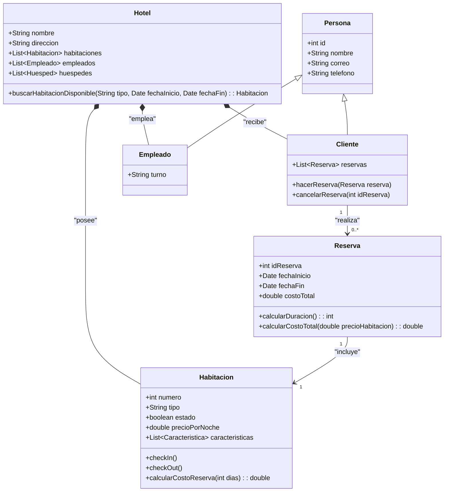
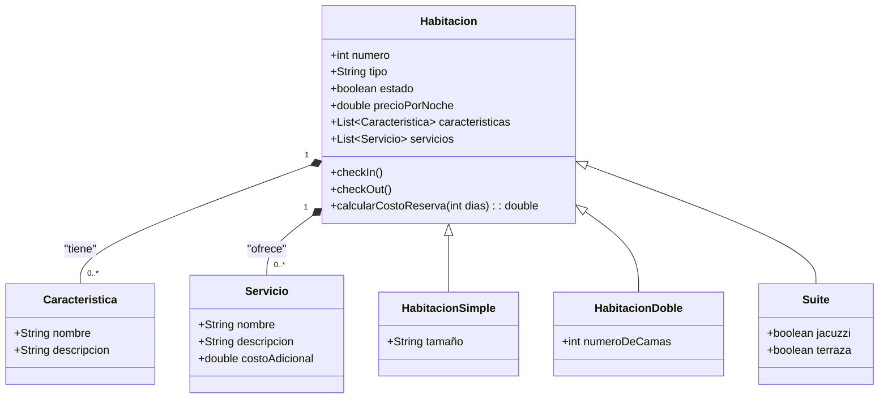
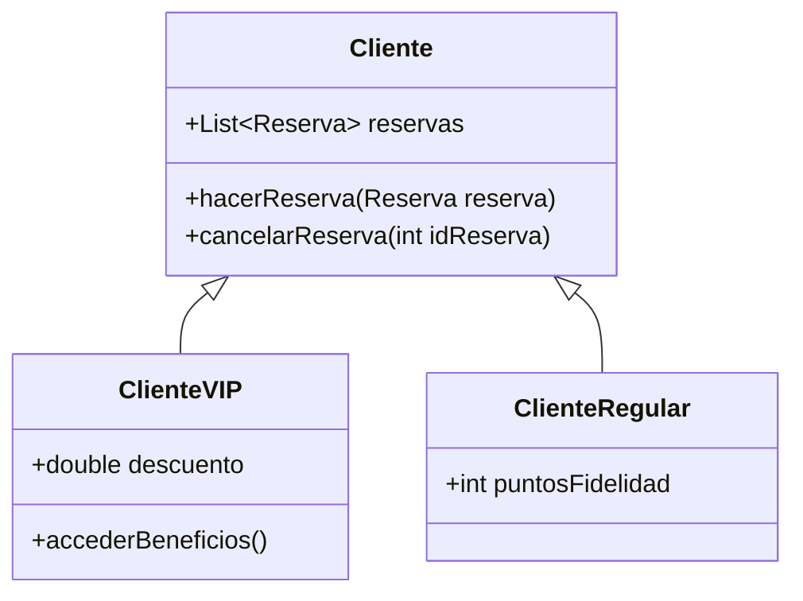
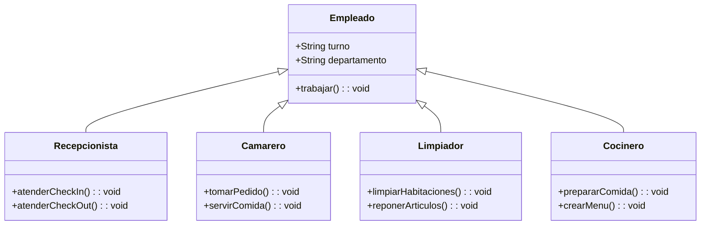
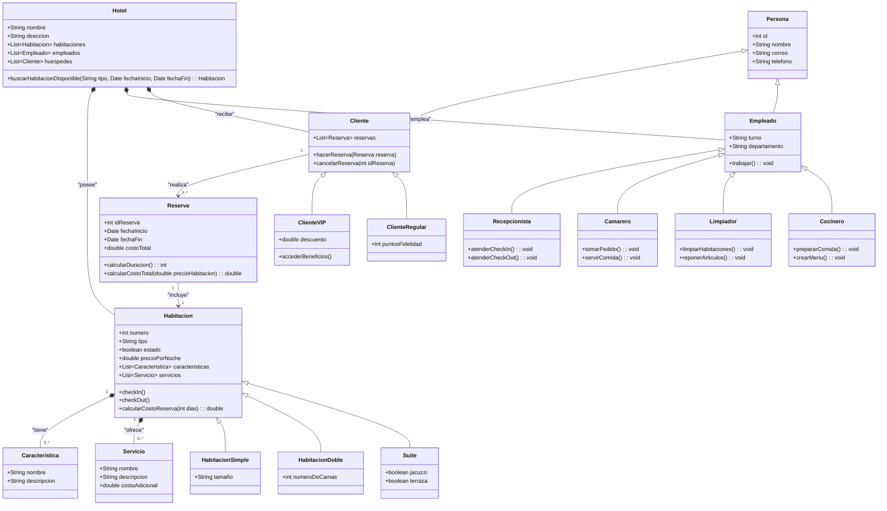

# Reto #02 - Sistema de Gestión de Reservas de Hotel

**- Diagrama de Clases: Gestión de Reservas Hoteleras**

#
**- Diagrama de Clases: Tipos de Habitaciones**

# 

**- Diagrama de Clases: Tipos De Cliente**

**- Diagrama de Clases: Roles de los Empleados**

#
**- Diagrama Completo**

